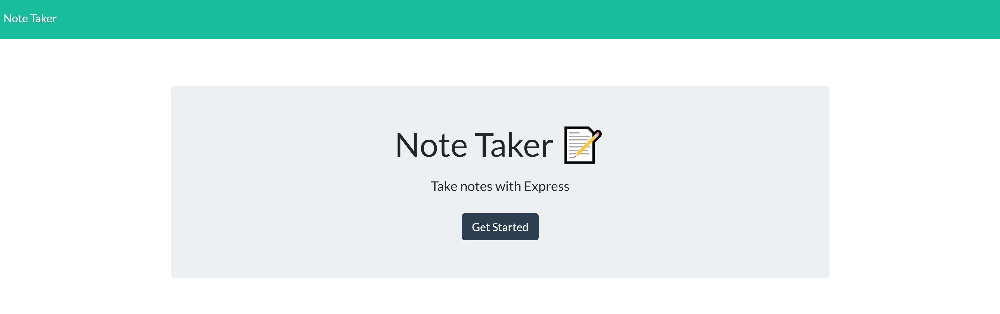
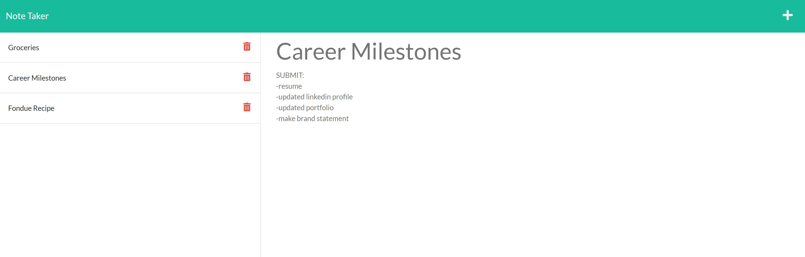

# Express Note Taker


## Description
 Create an application that allows a user to organize their thoughts and keep track of tasks that needs to be completed. You will be utilizing Express.js which will save and retrieve note data from a JSON file. The application will be deployed using Heroku. 

## Table of Contents
1. [Installation](#installation)
2. [Task](#task)
3. [Usage](#usage)
4. [Deployed](#deployed)
5. [Screenshots](#screenshots)
6. [Video](#video)
7. [License](#license)
8. [Questions](#questions)

## Installation
The following dependencies were installed to run the application. 
* [npm inquirer package](https://www.npmjs.com/package/inquirer)
* [npm express package](https://www.npmjs.com/package/express)
* [npm nodemon package](https://www.npmjs.com/package/nodemon)
* [npm uuid package](https://www.npmjs.com/package/uuid)

## Task
In order to use this application, the following requirements are met when:
```
GIVEN a note-taking application
WHEN I open the Note Taker
THEN I am presented with a landing page with a link to a notes page
WHEN I click on the link to the notes page
THEN I am presented with a page with existing notes listed in the left-hand column, plus empty fields to enter a new note title and the note’s text in the right-hand column
WHEN I enter a new note title and the note’s text
THEN a Save icon appears in the navigation at the top of the page
WHEN I click on the Save icon
THEN the new note I have entered is saved and appears in the left-hand column with the other existing notes
WHEN I click on an existing note in the list in the left-hand column
THEN that note appears in the right-hand column
WHEN I click on the Write icon in the navigation at the top of the page
THEN I am presented with empty fields to enter a new note title and the note’s text in the right-hand column
```

## Usage
This application should be hosted locally via Heroku. However, if the application is no longer running, or you just wish to run it locally, you can follow these instructions:

#### Step 1
Clone this repository to receive all of the files.

#### Step 2
Run the command 'npm i' command in your terminal at the root directory level to install the packages.

#### Step 3
Ensure you have Node.js installed on your machine. The application will be invoked by entering `node server.js` in the command line.

#### Step 4
You will see App running on port 3000! in the console. You can then view the app on http://localhost:3000/.

This program can be run through a browser using the above link to the the deployed application.

## Deployed
[Note Taker Deployed Application](https://note-taker-inna.herokuapp.com/)

## Screenshots



## Video
[Note taker walkthrough video](https://youtu.be/4kne4SgtYfU)

## License
 This project is covered under MIT.

## Questions
For inquiries about the repo, you can find me through GitHub at [inna-arabejo](https://github.com/inna-arabejo). 
For any additional questions, you can reach me through my email at [iarabejo3@gmail.com](mailto:iarabejo3@gmail.com).

